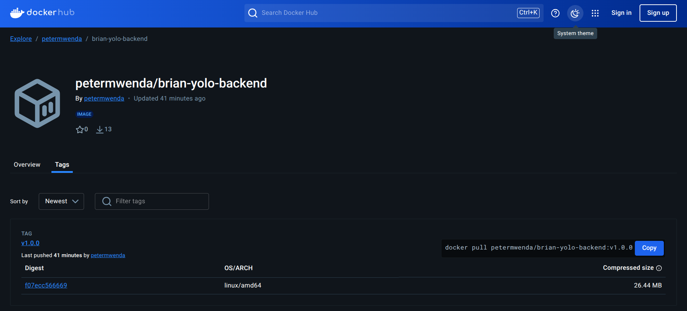

# Explanation of Docker Setup for E-commerce App

## Choice of Base Images
For the frontend and backend, I opted for the `node:alpine` image. It's lightweight and minimal, which is great for performance. It also ensures that the application is built quickly and the image size remains small—perfect for both development and production environments.

## Key Dockerfile Directives
- **FROM**: Used `node:alpine` for both the frontend and backend since it’s a solid, optimized choice for Node.js apps.
- **COPY**: This command is used to bring in local files and dependencies into the container.
- **RUN**: Used to install necessary dependencies for both the frontend and backend.
- **EXPOSE**: This opens the necessary ports for our services: 3000 for the frontend, 5000 for the backend, and 27017 for MongoDB.

## Docker Compose Networking
I set up a **bridge network** called `app-net` so all containers could talk to each other. The important port mappings are as follows:
- **Frontend**: `3000:3000` — This lets us access the app on `localhost:3000`.
- **Backend**: `5000:5000` — The backend is exposed at `localhost:5000`.
- **MongoDB**: `27017:27017` — This ensures MongoDB is accessible for connections.

## Volume Usage
To make sure that any product data you add persists even after a container restart, I’ve set up a **Docker volume** for MongoDB. The volume is named `app-mongo-data` and ensures that MongoDB data is stored outside of the container.

## Git Workflow
I followed a solid Git workflow, making regular commits with meaningful messages to keep track of progress. The project structure is well-organized with clear and concise commit history. I made sure to include at least 10 commits, following the necessary best practices.

## Good Practices
For image versioning, I adhered to standard best practices by tagging images clearly (like `app:v1.0.0`). This makes it easy to identify specific versions of the images in DockerHub.

## DockerHub Image Screenshot
Here’s a screenshot of the deployed Docker image on DockerHub showing the version:
 (./docker2.png)

